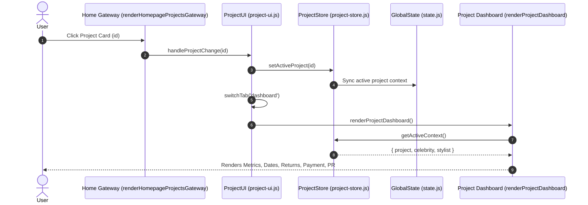

# ASCEND Atelier Studio — Complete Technical Architecture & Functionality Specification

> **Document Version:** 4.0 (Comprehensive Developer & Stitch UI Blueprint)  
> **Target Audience:** Stitch Full-Stack Engineers, UI Developers, System Architects  
> **Application:** ASCEND Atelier Studio (Luxury Jewellery PR & Curation Management Platform)  

---

## 1. System Architecture & Technology Stack

**ASCEND Atelier Studio** is an ultra-fast, client-side Single Page Application (SPA) designed for luxury jewellery ateliers, high-fashion stylists, and PR agencies.

```
┌──────────────────────────────────────────────────────────────────────────────────────────────────┐
│ SYSTEM ARCHITECTURE                                                                              │
├──────────────────────────────────────────────────────────────────────────────────────────────────┤
│ CLIENT BROWSER RUNTIME (SPA)                                                                     │
│ ┌──────────────────────────────────────────────────────────────────────────────────────────────┐ │
│ │ UI / DOM LAYER (`index.html`, `project-ui.js`, `app.js`, `mini-website.js`)                   │ │
│ │ • Home Gateway • Project Dashboard • Inventory Catalog • Pulls • Final Tray • Returns        │ │
│ ├──────────────────────────────────────────────────────────────────────────────────────────────┤ │
│ │ REACTIVE STATE BUS (`js/state.js`)                                                           │ │
│ │ • `state.data` • `state.selected` • `state.finalTraySerials` • `state.activeCategory`        │ │
│ ├──────────────────────────────────────────────────────────────────────────────────────────────┤ │
│ │ LOCAL PERSISTENCE & DATA ADAPTER (`js/modules/project-store.js`)                             │ │
│ │ • LocalStorage Key: `ascend_projects_data`                                                   │ │
│ │ • Methods: `getProjects()`, `updateProject()`, `setActiveProject()`, `createProject()`        │ │
│ ├──────────────────────────────────────────────────────────────────────────────────────────────┤ │
│ │ DOCUMENT ENGINE (`js/pdf/pdf.js`)                                                            │ │
│ │ • `html2pdf.js` / `jsPDF` Vector Rendering Pipeline                                          │ │
│ └──────────────────────────────────────────────────────────────────────────────────────────────┘ │
├──────────────────────────────────────────────────────────────────────────────────────────────────┤
│ BACKEND NODE.JS SERVER (`server.js`)                                                             │
│ • Express static asset hosting (`app.use(express.static(__dirname))`)                            │
│ • Catch-all SPA routing (`app.get("*", (req, res) => res.sendFile("index.html"))`)             │
└──────────────────────────────────────────────────────────────────────────────────────────────────┘
```

---

## 2. Complete Data Models & Database Schemas (`project-store.js`)

All project records are persisted in `localStorage` under `ascend_projects_data`. If the key does not exist, `ProjectStore.init()` automatically hydrates the store with verified seed data.

### 2.1 Project Entity Schema (`Project`)
```typescript
interface Project {
  id: string;                       // Unique ID (e.g. "proj_01", "proj_1723910293")
  celebrityId: string;              // Foreign Key -> Celebrity.id
  stylistId: string;                // Foreign Key -> Stylist.id
  headStylist: string;              // Name of lead stylist (e.g. "Natasha K")
  jewelleryBrand: string;           // Lending brand (e.g. "Ascend Fine Jewellery")
  code: string;                     // Campaign reference code (e.g. "LB-2026-FW01")
  title: string;                    // Project Title (e.g. "Red Carpet Gala Pull (Shreya)")
  season: string;                   // Fashion Season (e.g. "Fall / Winter 2026")
  purpose: string;                  // Campaign Purpose (e.g. "Red Carpet Gala", "Vogue Cover")
  status: string;                   // Curation Stage: "Curating" | "Lookbook Sent" | "Celebrity Approved" | "Sample Reserved" | "Order Placed"
  projectStatus: string;            // Operational Status: "Active" | "Upcoming" | "Completed" | "Pending Return"
  notes: string;                    // Curator / Stylist internal notes
  
  // Date Fields
  finalTraySharedDate: string;      // YYYY-MM-DD (Date pieces were locked / dispatched)
  followUpDate: string;             // YYYY-MM-DD (Defaults to finalTraySharedDate + 15 days)
  returnDueDate: string;            // YYYY-MM-DD (Scheduled return check-in date)
  
  // Product Return Breakdown
  productStats: {
    totalSent: number;              // Total serialized assets dispatched
    returned: number;               // Assets safely checked into safe
    pendingReturn: number;          // Assets still out with client
    missing: number;                // Assets flagged as missing / damaged
  };

  // Deliverables Tracking
  deliverables: {
    total: number;                  // Agreed deliverables count (e.g. 4)
    completed: number;              // Completed deliverables count (e.g. 3)
    items?: Array<{
      id: string;
      name: string;                 // e.g. "Lookbook Selection PDF", "Red Carpet Appearance"
      isDone: boolean;
    }>;
  };

  // Social PR & Media Attribution
  socialPosting: {
    status: "Pending" | "Posted" | "Verified";
    postDate: string;               // YYYY-MM-DD
    socialUrl?: string;             // Instagram / Media link
    verifiedByStylist: boolean;
    tags?: string[];                // e.g. ["@shreya", "@ascendjewels"]
  };

  // Financial Invoicing
  payment: {
    status: "Paid" | "Partial" | "Pending" | "Overdue";
    invoiceAmount: number;          // Total billing amount in INR (₹)
    amountReceived: number;         // Total collected amount in INR (₹)
    outstandingBalance: number;     // invoiceAmount - amountReceived
  };

  // Serialized Asset Lists
  selectedSerials: string[];        // Array of serials in Staged Pulls (e.g. ["RING-001", "EAR-042"])
  finalTraySerials: string[];       // Array of serials in Final Tray (e.g. ["RING-001"])
  returnedSerials: string[];        // Array of serials returned to vault
  
  // Audit Trail
  activityLog: Array<{
    timestamp: string;              // ISO String or formatted datetime
    action: string;                 // e.g. "Status Updated", "Return Logged"
    description: string;            // e.g. "Received ₹1,00,000 partial payment"
  }>;
  
  createdAt: string;                // ISO timestamp
  updatedAt: string;                // ISO timestamp
}
```

### 2.2 Celebrity Entity Schema (`Celebrity`)
```typescript
interface Celebrity {
  id: string;                       // e.g. "celeb_01"
  name: string;                     // e.g. "Shreya Ghosal"
  category: string;                 // e.g. "Playback Singer & Artist", "Film Actor"
  phone?: string;
  email?: string;
  house?: string;                   // Management agency (e.g. "Matrix PR", "YRF Talent")
}
```

### 2.3 Stylist Entity Schema (`Stylist`)
```typescript
interface Stylist {
  id: string;                       // e.g. "stylist_01"
  name: string;                     // e.g. "Natasha K"
  title: string;                    // e.g. "Lead Celebrity Stylist"
  specialty?: string;               // e.g. "Red Carpet & Haute Couture"
}
```

### 2.4 Inventory Catalog Item Schema (`CatalogItem`)
```typescript
interface CatalogItem {
  serial: string;                   // e.g. "RING-001" (Primary Key)
  title: string;                    // e.g. "Diamond Solitaire Halo Ring"
  category: string;                 // "Rings" | "Earrings" | "Necklaces" | "Bracelets" | "High Jewellery"
  type: string;                     // "Solitaire", "Cocktail", "Chandelier", "Choker", "Tennis"
  metal: string;                    // "18k Yellow Gold", "18k White Gold", "Platinum", "Rose Gold"
  stone: string;                    // "Diamond", "Emerald", "Sapphire", "Ruby", "Pearl"
  price: number;                    // Indicative retail / insurance valuation in INR (₹)
  image: string;                    // Relative asset path or URL
  brand: string;                    // e.g. "Ascend Fine Jewellery"
  availability: "Available" | "In Pull" | "Reserved" | "Out on Loan";
}
```

---

## 3. Data Fetching, Persistence & Calculations

### 3.1 Data Hydration Pipeline
1. **Initial Load:** On app launch, `ProjectStore.init()` executes:
   - Reads `localStorage.getItem('ascend_projects_data')`.
   - If empty, loads initial seed projects (`SEED_PROJECTS`), celebrities (`SEED_CELEBRITIES`), and stylists (`SEED_STYLISTS`).
   - Normalizes data structures (ensuring `productStats`, `payment`, `deliverables`, `socialPosting` exist on every project).
   - Writes back to `localStorage`.
2. **Catalog Load:** `catalog-data.js` loads the jewelry inventory (`RAW_CATALOG_DATA`) into `state.data`.

### 3.2 Key Formulas & Real-Time Computations
* **Return Progress Percentage:**
  $$\text{Return \%} = \text{Math.round}\left(\frac{\text{returned}}{\text{totalSent}} \times 100\right)$$
  *(Defaults to $100\%$ if $\text{totalSent} = 0$, or $0\%$ if $\text{returned} = 0$.)*
* **Outstanding Financial Balance:**
  $$\text{Outstanding Balance} = \max(0, \text{invoiceAmount} - \text{amountReceived})$$
* **15-Day Follow-Up Date Calculation:**
  $$\text{followUpDate} = \text{addDaysToDateString}(\text{finalTraySharedDate}, 15)$$
* **Overdue Date Detection:**
  $$\text{isOverdue} = (\text{targetDate} < \text{todayDateString}) \land (\text{status} \neq \text{"Completed"})$$
* **Due Today Detection:**
  $$\text{isDueToday} = (\text{targetDate} = \text{todayDateString})$$
* **Pagination Slice Calculation:**
  $$\text{startIndex} = (\text{page} - 1) \times \text{itemsPerPage}, \quad \text{endIndex} = \text{startIndex} + \text{itemsPerPage}$$

---

## 4. Complete Function Manifest & Execution Flow



### 4.1 Home Page Module (`renderHomepageProjectsGateway`)
* **Function:** `renderHomepageProjectsGateway(onProjectSwitch)`
* **Execution Logic:**
  1. Retrieves all projects via `ProjectStore.getProjects()`.
  2. Applies active search query, celebrity filter, stylist filter, brand filter, and status filters.
  3. Sorts and paginates matching projects (6 projects per page).
  4. Renders `.hp-project-card` containers containing **ONLY**:
     - `.hp-card-stylist-block` (`headStylist`)
     - `.hp-card-title-block` (`p.title`)
     - `.hp-card-celebrity-block` (`celebrityName`)
     - `.hp-dates-vertical` (`finalTraySharedDate`, `followUpDate`, `returnDueDate`)
  5. Attaches click listener: `onclick="window.handleProjectChange('${p.id}')"`.

---

### 4.2 Project Dashboard Module (`renderProjectDashboard`)
* **Function:** `renderProjectDashboard()`
* **Execution Logic:**
  1. Resolves active project via `ProjectStore.getActiveContext()`. If none is selected, shows an empty state prompt.
  2. Injects complete dashboard HTML into `#projectDashboardContent`:
     - **Top Action Bar:** Back button + Quick action triggers.
     - **Hero Banner:** Code, Stylist, Celebrity, Brand, Season, Purpose, and Stage selector.
     - **Metrics Row:** Curated pieces count, Return %, Received revenue, Social PR status.
     - **Important Dates Panel:** Final list, 15-day follow-up (with overdue/due today alerts), return due date.
     - **Product Status & Returns Panel:** Sent, Returned, Pending, Missing counts + progress bar.
     - **Social Media & PR Panel:** Verified status, scheduled date, tags.
     - **Payment & Invoicing Panel:** Invoice total, received amount, outstanding balance.
     - **Deliverables Panel:** Checklist of agreed assets and progress bar.
     - **Notes & Activity Timeline:** Stylist notes callout + chronological activity history.

---

### 4.3 Modal Controllers & Handlers (`project-ui.js`)

| Method Name | Parameters | Internal Logic & State Change | Why It Is Important |
| :--- | :--- | :--- | :--- |
| `window.openNewProjectDialog()` | None | Displays `#newProjectModalOverlay`. Populates stylist dropdown. | Quick project onboarding. |
| `window.handleCreateProjectSubmit(e)` | `event` | Gathers form data, generates unique ID (`proj_timestamp`), calls `ProjectStore.createProject(data)`, sets active project, switches to `#dashboardTab`, renders Dashboard. | Seamless campaign initialization without page reload. |
| `window.openQuickEditProjectModal(id)` | `projectId` | Reads project data, populates `#quickEditProjectModal` inputs (title, stylist, brand, dates, status, payment numbers), and displays modal. | Instant access to edit all core project metadata. |
| `window.handleQuickEditProjectSubmit(e)` | `event` | Reads edited values, calls `ProjectStore.updateProject(id, updates)`, adds timestamped entry to `activityLog`, re-renders Dashboard. | Immediate persistence of project revisions. |
| `window.openQuickUpdateReturnModal(id)` | `projectId` | Populates `#quickReturnModal` with `totalSent`, `returned`, `pendingReturn`, `missing`. | Frictionless return count updates. |
| `window.handleQuickReturnSubmit(e)` | `event` | Calls `ProjectStore.updateProjectReturns(id, stats)`, logs activity, re-renders Dashboard. | Keeps vault inventory counts 100% accurate. |
| `window.openQuickUpdateDeliverablesModal(id)` | `projectId` | Populates `#quickDeliverablesModal` with deliverable counts & checklist. | Tracks contract fulfillment. |
| `window.handleQuickDeliverablesSubmit(e)` | `event` | Updates deliverable counts in `ProjectStore`, re-renders Dashboard. | Assures PR deliverables are delivered on schedule. |
| `window.quickToggleSocialPosted(id)` | `projectId` | Cycles social stage: `Pending` → `Posted` → `Verified` → `Pending`. Updates `activityLog` and re-renders Dashboard. | Single-click PR attribution tracking. |
| `window.updateCurrentProjectStatus(id, stage)` | `projectId, stage` | Updates curation lifecycle stage in `ProjectStore`, logs transition, updates UI status badges. | Keeps atelier, stylists, and PR in sync. |
| `window.checkFollowUpReminders()` | None | Scans all projects for 15-day follow-up dates matching today or overdue. Opens `#followUpReminderModalOverlay` if matches found. | Automated client check-in reminder system. |

---

### 4.4 Inventory Catalog & Pulls Staging (`app.js`, `state.js`)
* **`filterCategory(cat)`**: Updates `state.activeCategory`, resets pagination to page 1, and calls `renderGrid()`.
* **`togglePull(serial)`**:
  - Checks if `serial` is in `activeProject.selectedSerials`.
  - If present: Removes serial, decrements pull count.
  - If absent: Adds serial, increments pull count.
  - Synchronizes `state.selected` and saves to `ProjectStore`.
  - Updates floating dock counter and sidebar badge.
* **`promoteToFinalTray()`**:
  - Copies all staged serials from `project.selectedSerials` to `project.finalTraySerials`.
  - Sets `project.finalTraySharedDate = todayDateString`.
  - Automatically calculates `project.followUpDate = addDaysToDateString(todayDateString, 15)`.
  - Saves project and switches to `#finalTrayTab`.

---

### 4.5 Lookbook PDF Studio Engine (`js/pdf/pdf.js`)
* **Pipeline:**
  1. Extracts items in `project.finalTraySerials` or `state.selected`.
  2. Generates an off-screen print DOM container styled with `Playfair Display` fonts, high-res product photos, metal/gemstone specifications, carats, and optional prices.
  3. Uses `html2pdf.js` / `jsPDF` to compile a multi-page vector PDF lookbook.
  4. Generates a Blob URL and initiates an automatic browser download (`lookbook-[project-code].pdf`).

---

## 5. Global API Registry (Bound to `window`)

```javascript
// Navigation & Workspace
window.switchTab(tabName);                         // 'dashboard' | 'browse' | 'selected' | 'finalTray' | 'returnProducts'
window.showHomepageGateway();                     // Opens Home Projects Gateway overlay
window.unlockStudioWorkspace();                   // Unlocks main navigation shell

// Project Context & Dashboard
window.handleProjectChange(projectId);            // Sets active project and routes to Dashboard
window.renderProjectDashboard();                  // Re-renders the Project Dashboard view
window.renderDashboard();                         // Delegate alias to renderProjectDashboard

// Modal Controllers
window.openNewProjectDialog();                    // Opens New Project creation dialog
window.closeNewProjectDialog();                   // Closes New Project dialog
window.openQuickEditProjectModal(projectId);      // Opens Quick Edit Project modal
window.closeQuickEditProjectModal();              // Closes Quick Edit Project modal
window.openQuickUpdateReturnModal(projectId);     // Opens Quick Return Update modal
window.closeQuickUpdateReturnModal();             // Closes Quick Return Update modal
window.openQuickUpdateDeliverablesModal(projectId);// Opens Quick Deliverables modal
window.closeQuickUpdateDeliverablesModal();       // Closes Quick Deliverables modal
window.quickToggleSocialPosted(projectId);        // Cycles social PR status
window.updateCurrentProjectStatus(projectId, st); // Updates curation stage

// Filters & Pagination
window.toggleHomepageProjectFilters();            // Expands/collapses Home filters drawer
window.toggleHomepageProjectMenu();               // Expands/collapses Home stats overview
window.clearHomepageProjectFilters();             // Resets all active Home filters
window.setHomepagePage(pageNumber);               // Changes active page index on Home
```

---

## 6. Why Every Functionality Is Critical For Business

1. **Information Architecture Separation:** Eliminates executive cognitive overload on the Home page while maintaining 100% operational fidelity inside the Dashboard.
2. **Automated 15-Day Follow-Up Engine:** Prevents multi-crore jewelry loan losses by alerting account managers before return deadlines expire.
3. **5-Stage Curation State Machine:** Establishes clear ownership between curation, client review, approval, reservation, and physical dispatch.
4. **4-Metric Asset Return Tracker:** Guarantees vault custody integrity and provides immediate audit trails for insurance and police reporting.
5. **Real-Time Financial Invoicing:** Prevents uncollected revenue, manages security deposits, and calculates outstanding stylist fees.
6. **Social PR Attribution Tracker:** Proves marketing ROI for luxury brands by linking loaned assets to verified celebrity social media impressions.
7. **Vector PDF & Interactive Web Showcase:** Enables instant, high-fashion client presentations during fast-paced red carpet fittings.
8. **Robust Local Persistence (`localStorage`):** Delivers zero-latency, offline-capable performance in secure atelier vaults without network dependencies.
